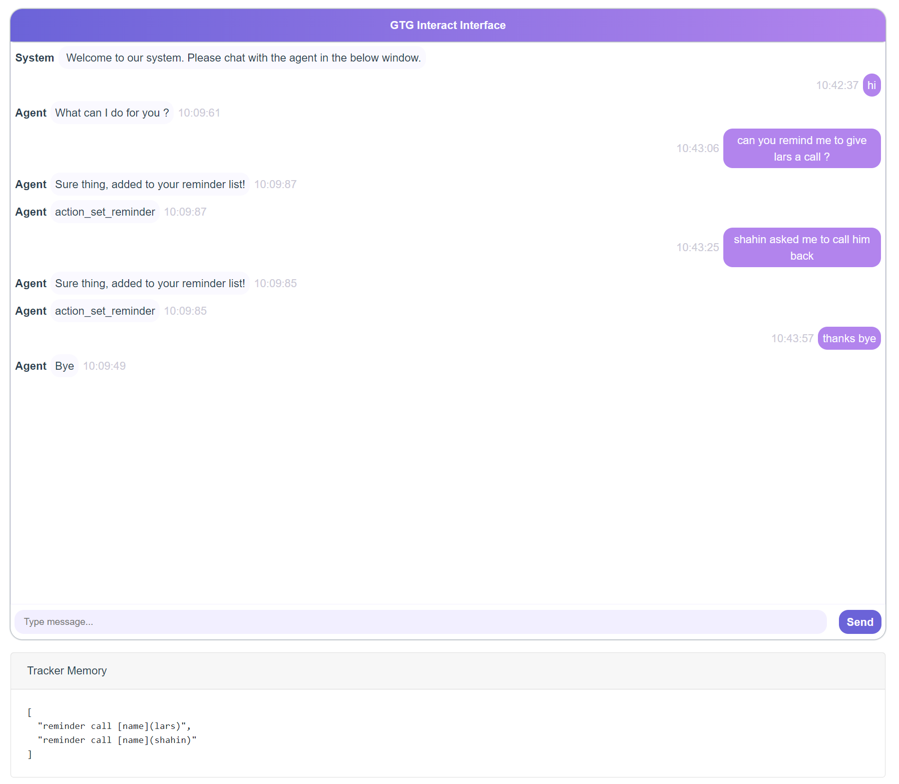

# COOKING UP A CONVERSATION WITH SOLOIST - FINETUNING AN END-TO-END MODEL FOR A NEW DOMAIN

## Introduction
* For documentation of SOLOIST, please refer to the [repository](https://github.com/pengbaolin/soloist) of Soloist's authors
* In this repository we show case a new domain: **recipe** recommendation, where the bot is asked to recommend a suitable recipe based on:
    * **ingredients**: user's preferable main ingredient
    * **type**: main dish, salad, soup, beverage, dessert
    * **is_vegan**: binary
    * **difficulty**: easy, medium, difficult
    * **time**: time (in minutes) to prepare and cook
* The bot could provide serveral pieces of information
    * recipe's **name**
    * **ingredients**: list of all ingredients needed
    * **equipment**: e.g oven, big salad bowl... 
    * **instruction**: step-by-step how to prepare and cook
    * **substitute**: if it is possible to substitute some ingredients with an alternative
    * and further information related to each recipe: type, vegan, difficulty, time...
* For the detailed report, please refer to this [link](https://docs.google.com/document/d/1F-HPy6cI-tPWWeAzBCw6Mpq-yxSDs__dQhwoWS1HvEc/edit?usp=sharing)
* For a short version of report, please refer to this [link]([github](https://github.com/Yen444/soloist/blob/main/SDS_Recipe.pdf))

## Installation
Require python 3.6.  

Please use the below commands to clone the repo and install required package.
```
git clone https://github.com/Yen444/soloist.git
pip install -r requirements.txt
```
* Download pretrained model
```
# gtg_pretrained 
https://drive.google.com/file/d/1BNhY_GCx5f_Ubv_8mx6PHa6mFDAG7ujh/view?usp=drive_link
# finetuned_models
https://drive.google.com/drive/folders/1VjnxouEe04yrokzllFpevXi7Jw-h_JDK?usp=sharing
```
* Copy `gtg_pretrained` and `finetuned_models` to the same directory where you see soloist_train.py, that is:
```
soloist/soloist/gtg_pretrained
soloist/soloist/finetuned_models
```

## Pipeline
**Data format**
```json
    {
        "history": [
            "user : I'm in the mood for a dessert. Can you suggest something sweet? "
        ],
        "kb": "kb : more than three",
        "belief": "belief : type = dessert ; ingredients = not mentioned ",
        "reply": "system : Sure! I have a few recipes for dessert. Do you have any preferences or restrictions?",
        "dp": "dp : request ( ingredients ) "
    }
```
We use json to represent a training example. As shown in the example, it contains the following fields:
* **history** - The context from session beginning to current turn
* **belief** - The belief state of the user (slot - value pair). 
* **kb** - Database query results. If not blank, inference is slower but better.
* **reply** - The target system respose. It can be a template, an api call or natural language.
* **dp** - The system action or dialogue policy.

**Training**
* For baseline model
```bash
python soloist_train_experiment.py --output_dir $OUTPUT --model_type=gpt2 --model_name_or_path $MODEL_NAME --do_train --train_data_file $TRAIN_FILE --eval_data_file $EVAL_FILE --add_special_action_tokens=$SPECIAL_TOKEN_FILE --per_gpu_train_batch_size 1 --num_train_epochs $EPOCHS --learning_rate 5e-5 --overwrite_cache --max_seq 100 --overwrite_output_dir --max_turn 15 --num_candidates 1 --mc_loss_efficient 0.33 --add_response_prediction --add_same_belief_response_prediction --add_belief_prediction --save_steps 6000 [--add_kb_to_context][--evaluate_during_training] [--add_dp_to_response]
```
<code>output_dir</code>: Path of the saving model 
<code>model_name_or_path</code>: Initial checkpoint
<code>train_data_file</code>: Path to training file (in soloist-json format)
<code>eval_data_file</code>: Path to validation file (in soloist-json format)
<code>add_special_action_tokens</code>: Path to txt file that contains all special tokens (used for delexicalization)
<code>num_train_epochs</code>: Number of training epochs, should be tuned using validation set. For 40 training dialogues we fine-tuned with 9 epochs.  
<code>learning_rate</code>: Learning rate; 5e-5, 1e-5, or 1e-4.  
<code>num_candidates</code>: number of candidate; recommend 1.  
<code>mc_loss_efficient</code>: contrastive loss coefficient; 0.1 to 1.  
<code>add_belief_prediction</code>: if add contrastive loss item for belief span.  
<code>add_response_prediction</code>: if add contrastive loss item for response prediction.  
<code>add_same_belief_response_prediction</code>: if add contrastive loss item for belief span and response.  
<code>add_dp_to_response</code>: if output dialogue policy before natural language response. 
<code>add_kb_to_context</code>: if add database states to context.  
<code>evaluate_during_training</code>: if compute perplexity for each step.  
 

**Generation**
```bash
python soloist_decode_experiment.py model_type=gpt2 --model_name_or_path $OUTPUT --num_samples $NS --input_file=$TEST_FILE --top_k $TOP_K --temperature $TEMP --output_file $GENERATE --max_turn 15 [--add_kb_to_context]
```
<code>model_name_or_path </code>: Path of the saved model.  
<code>num_samples </code>: Number of samples; 1 or 5 for reranking.  
<code>top_k </code>: Top k sampling, 3
<code>temperature </code>: Temperature sampling; 0.7 - 1.5  
<code>input_file </code>: Path to test file in soloist-json format.  
<code>output_file </code>: Path to save results.
<code>add_kb_to_context </code>: If model is aware of database state.

**Interaction**  

We provide an demo interface to chat with finetuned models. The backend server is based on *flask* and the interface is based on *vue*, *bootstrap-vue*, and *BasicVueChat*.

Start the backend server:
```bash
# under soloist/examples/recipe
python recipe_server.py # start the sever and expose 8081 port
```
Start serving frontend page:
```bash
npm install
npm run serve 
```
Open localhost:8080, you will see the following page. Note that the backend port should be consistent with the port used in html/compoents/chat.vue.



